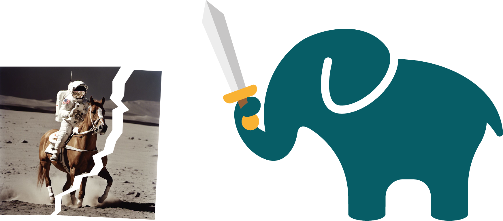

# [[CVPR2024] AEROBLADE: Training-Free Detection of Latent Diffusion Images Using Autoencoder Reconstruction Error](https://openaccess.thecvf.com/content/CVPR2024/html/Ricker_AEROBLADE_Training-Free_Detection_of_Latent_Diffusion_Images_Using_Autoencoder_Reconstruction_CVPR_2024_paper.html)
[Jonas Ricker](https://jonasricker.com), [Denis Lukovnikov](https://informatik.rub.de/ml/people/lukovnikov/), [Asja Fischer](https://informatik.rub.de/fischer/)    
IEEE/CVF Conference on Computer Vision and Pattern Recognition (CVPR), 2024

<p align="center">
 
</p>

## Setup
Create a virtual environment and run
```
pip install -r requirements.txt
pip install -e .
```
(tested with Python 3.10).

## Quickstart
If you simply want to use AEROBLADE for detection, run
```
python scripts/run_aeroblade.py --files-or-dirs path/to/img.png path/to/dir
```
Calling the script without any arguments will use the images in `example_images`.
Note that if you provide a directory, all images must have the same dimensions.
By default, it computes the reconstructions using the AEs from Stable Diffusion 1, Stable Diffusion 2, and Kandinsky 2.1 and measures the distance using the second LPIPS layer, which performed best in our experiments. Use `-h` to learn more about the available options.

The computed distances are printed and saved to `aeroblade_output/distances.csv`. Note that we save the negative distances, which is why the best AE is denoted by `max`.

## Reproducing our Experiments
Here we provide the commands to reproduce our experimental results.
Note the following:
- Your results might differ slightly due to randomness and different library versions.
- Code to reconstruct the tables and figures is provided in the notebooks corresponding to the script names.
- Most results are automatically cached to avoid repeated computations (the `cache` directory can grow quite large).
- All reconstructions are saved in `data/reconstructions`, in unique directories for each configuration.

### Data
Our data can be downloaded from [Zenodo](https://zenodo.org/doi/10.5281/zenodo.10997234). Extract the `.zip` file and place the `data` directory inside the root directory of this repository.

**Generated Images**
All generated images are readily available in `data/raw/generated`. For Stable Diffusion and Kandinsky, the directory name also contains the CLIP model used to extract the prompts, e.g., `CompVis-stable-diffusion-v1-1-ViT-L-14-openai`. We also provide the extracted prompts in `data/raw/prompts`.

**Real Images**
Since the real images from LAION-5B are subject to copyright, we cannot distribute them (see [FAQ](https://laion.ai/faq/)).
Therefore, you will have to reconstruct the real dataset from the image URLs provided in `data/real/real_metadata.parquet`.
The following command will attempt to download the images from their respective URLs to `tmp/laion`:
```
img2dataset --url_list data/raw/real/real_metadata.parquet --input_format "parquet" --url_col "URL" --caption_col "TEXT" --output_folder tmp/laion --resize_mode "center_crop" --min_image_size 512 --max_image_area 589824 --image_size 512 --encode_format "png" --encode_quality 6
```
To ensure that the filenames correspond to the extracted prompts, you can run
```
python scripts/rename_real_images.py
```
The renamed files will be saved to `data/raw/real`.

**Note:** Images from LAION tend to become unavailable over time, which is why your dataset will likely be incomplete.
As a remedy, our scripts have the option to use pre-computed results for real images, which is detailed below.
You can also run the evaluations with a reduced number of images or use different real images.

### 5.2. Evaluation of Detection Performance
```
python experiments/01_detect.py
```
To use pre-computed distances of real images add `--precomputed-real-dist data/precomputed/01_default_real_dist.pickle`.

### 5.4. Qualitative Image Analysis with AEROBLADE

#### Relation Between Image Complexity and Reconstruction Error
```
python experiments/02_analyze_patches.py
```
To use pre-computed distances and complexities of real images add `--precomputed-real-dist data/precomputed/02_default_real_dist.pickle --precomputed-real-compl data/precomputed/02_default_real_compl.pickle`.

### 5.5. Additional Analyses

#### Robustness to Perturbations
```
python experiments/01_detect.py --experiment-id robustness --amount 250 --transforms clean jpeg_90 jpeg_80 jpeg_70 jpeg_60 jpeg_50 blur_1.0 blur_2.0 blur_3.0 blur_4.0 blur_5.0 crop_0.9 crop_0.8 crop_0.7 crop_0.6 crop_0.5 noise_0.05 noise_0.1 noise_0.15 noise_0.2 noise_0.25
```
To use pre-computed distances of real images add `--precomputed-real-dist data/precomputed/01_robustness_real_dist.pickle`.

#### Exploring Different Distance Metrics
```
python experiments/01_detect.py --experiment-id distance_metric_ablation --distance-metrics lpips_vgg_0 lpips_alex_0 lpips_squeeze_0 psnr ssimc ms_ssim dists
```
To use pre-computed distances of real images add `--precomputed-real-dist data/precomputed/01_distance_metric_ablation_real_dist.pickle`.

#### Using Deeper Reconstructions
```
python experiments/03_deeper_reconstructions.py --experiment-id deeper_sd15 --real-dir data/raw/real --fake-dir data/raw/generated/runwayml-stable-diffusion-v1-5-ViT-L-14-openai --repo-id runwayml/stable-diffusion-v1-5
python experiments/03_deeper_reconstructions.py --experiment-id deeper_sd21 --real-dir data/raw/real --fake-dir data/raw/generated/stabilityai-stable-diffusion-2-1-base-ViT-H-14-laion2b_s32b_b79k --repo-id stabilityai/stable-diffusion-2-1-base
```
To use pre-computed distances of real images add `--precomputed-real-dist data/precomputed/03_deeper_sd15_real_dist.pickle` and `--precomputed-real-dist data/precomputed/03_deeper_sd21_real_dist.pickle`, respectively.
